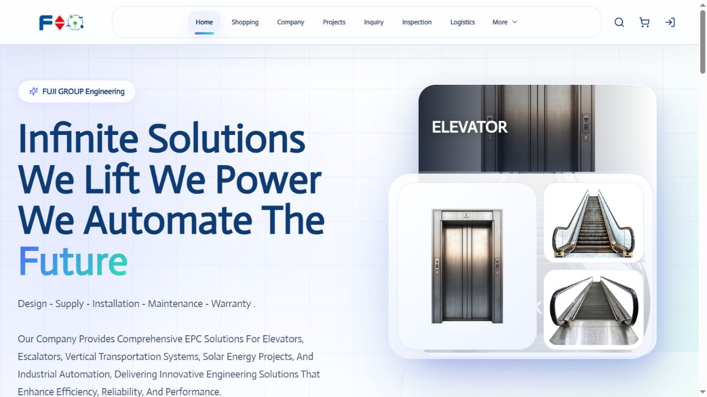

# FUJI Group — Fujihk

Dynamic engineering catalogue and business platform

**Live website · Private application source · Documentation and screenshots only**

[Live website](https://fujihk.net/) · [Portfolio case study](https://mohamed-abderrehmane-portfolio.hillock-factual9mupt.chatgpt.site/projects/fujihk/)

Connect engineering product discovery with detailed catalogue information and account-based business workflows in one live website.

## Features

- Engineering product catalogue spanning vertical transport, energy and automation categories
- Public search, category filters and price sorting controls
- Product detail pages with imagery, descriptions, price, quantity and related products
- Shopping cart and account entry points
- Company profile and navigation to projects, inquiry, inspection and logistics
- Fully dynamic application with a private super admin panel

## Bringing engineering products and business workflows together

I built Fujihk as a dynamic business website for FUJI Group. The product catalogue is central to the experience: visitors can search, filter by category, sort by price and open detailed product pages with quantities and related items. Company information, projects and operational navigation sit alongside the catalogue.

## Public discovery, private administration

I connected the public browsing experience to account-based workflows, including inquiry access. The application includes a super admin panel for administration. I keep its source code and internal administration private; this repository shares the project story and public interface screenshots.

For this project, the interesting design challenge was giving a broad engineering catalogue a clear route from discovery to product detail and account access. The listing and detail pages share the same product context, so visitors can explore without losing their place.

## Gallery and documentation

- [Gallery](docs/gallery.md)
- [Case study](docs/case-study.md)
